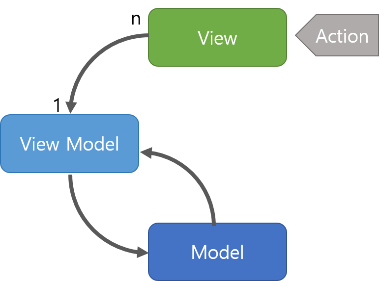
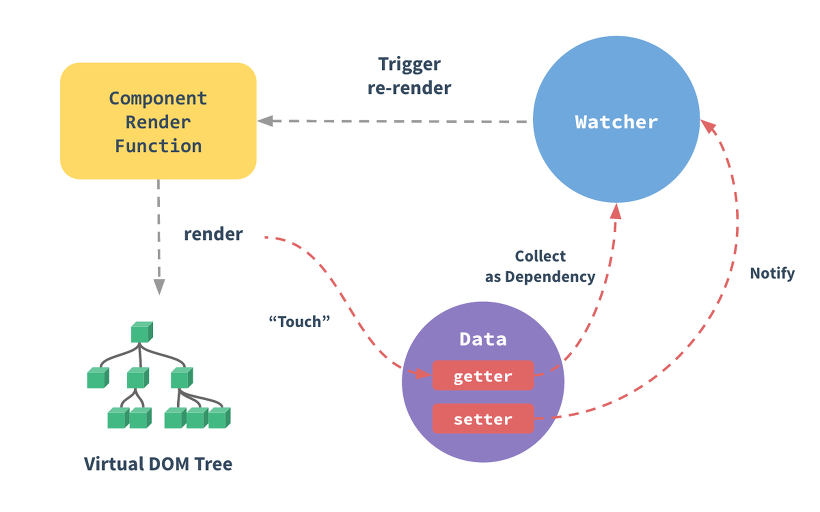

# Vue.js

## Vuex

Vuex는 중앙 위치에서 상태를 저장하여 어떤 컴포넌트라도 쉽게 상호 작용할 수 있게 돕는 라이브러리이다. <br>
`state`, `mutations`, `actions`, `getter` 4가지 형태로 관리가 되며 관리 포인트는 `store`라 불린다.

### State

Vue component에서는 원본 소스 역할인 data로 볼 수 있다. <br>
state는 mutation을 통해서만 변경이 가능하다.

### Mutations

유일하게 state를 변경할 수 있는 방법이여 메서도와 유사하다.
commit을 통해서만 호출할 수 있으며 함수로 구성된다.
API를 통해 전달받은 데이터를 mutations에서 가공하여 state를 변경한다.

### Actions

비동기 작업이 가능하다.
mutation을 호출하기 위한 commit이 가능하다.
action은 dispatch를 통해 호출할 수 있다.
axios를 통한 api 호출과 그 결과에 대해 return을 하거나 mutations으로 commit하는 용도로 사용된다.

### Getter

Vue component의 computed처럼 계산된 속성이다.
state에 대해 연산을 하고 그 결과를 view에 바인딩할 수 있다.
state의 변경 여부에 따라 view를 업데이트한다.

## Vuex 사용시 주의사항

- 페이지 **새로고침 시 store에 의존하는 데이터가 사라진다.** 이는 쿠키, 스토리지 등으로 작업할 수 있다.
  - 이는 쿠키, 스토리지 등으로 저장해준다.
  - `vuex-persistedstate` 라이브러리가 있기도 하다
    - 모든 store 값들을 localstorage로 저장할 시 속도 이슈가 발생할 수 있으니 option 확인 후 사용해야 한다.
- 단순한 앱일 경우 간단한 Global event bus가 더 깔끔할 수 있다.
- 성능 이슈가 생길 수 있으니 **배포 시 strict 모드를 키지 말자**

# 반응형 시스템

출저 : [[Vue.JS] 반응형 시스템](https://beomy.tistory.com/66)

Vue의 가장 두드러지는 특징 중 하나는 눈에 띄지 않는 반응형 시스템이다. 모델은 단순한 JavaScript 객체이다. 모델이 수정되면 화면이 갱신된다.

## MVVM 패턴

Vue는 MVVM 패턴에 영감을 받은 프레임워크이다.



View는 DOM, View Model은 Vue, Model은 단순한 JavaScript 객체이다. View Model은 View와 데이터 바인딩되어 View Model이 변경되었을 때 View가 업데이트 된다.

## 변경 내용을 추적하는 방법

Vue 인스턴스에 `data` 옵션을 포함하는 JavaScript 객체를 전달하면 Vue는 모든 속성에 Object.defineProperty를 사용하여 getter/setter로 변환합니다. 이것이 Vue가 ES5를 사용할 수 없는 IE8 이하를 지원하지 않는 이유이다.<br>
getter/setter는 사용자에게 보이지 않지만 속성에 접근하거나 수정할 때 Vue가 종속성 추적 및 변경 알림을 수행할 수 있다.

모든 컴포넌트 인스턴스에는 해당 **Watcher** 인스턴스가 있으며, 이 인스턴스는 컴포넌트가 종속적으로 렌더링되는 동안 수정된 모든 속성을 기록한다. 또한 종속적인 setter가 트리거 되면 Watcher에 알리고 컴포넌트가 다시 렌더링된다.



## 변경 감지 경고

최신 JavaScript의 한계(그리고 `Object.observe`의 포기)로 인해 Vue는 **속성의 추가 제거를 감지할 수 없다.** Vue는 인스턴스 초기화할 때 getter/setter 변환 프로세스를 수행하기 때문에 data 객체에 속성이 있어야 Vue가 변경사항을 감지할 수 있다.

```js
var vm = new Vue({
  data: {
    a: 1,
  },
});
// `vm.a`은 이제 반응적이다.

vm.b = 2;
// `vm.b`는 이제 반응적이지 않다.
```

이미 만들어진 인스턴스에 반응 속성을 동적으로 추가하는 것을 허용하지 않지만, `Vue.set(object, key, value)` 메소드를 사용하여 중첩된 객체에 반응성 속성을 추가할 수 있다.

```js
Vue.set(vm.someObject, 'b', 2);

this.$set(this.someObject, 'b', 2);
```

때로는 `Object.assign()` 또는 `_.extend()`를 사용하여 기존 객체에 많은 속성을 할당할 수 있다. 그러나 객체에 추가된 새 속성은 변경 내용을 트리거하지 않는다. 이 경우 원본 객체와 mixin 객체의 속성을 사용하여 새 객체를 만든다.

```js
// `Object.assign(this.someObject, { a: 1, b: 2})` 대신에
this.someObject = Object.assign({}, this.someObject, { a: 1, b: 1 });
```

## 반응형 속성 선언하기

Vue는 반응성 속성을 동적으로 추가할 수 없기 때문에 반응성 데이터 속성을 빈 값으로라도 초기에 선언하여 Vue 인스턴스를 초기화 해야한다.

```js
var vm = new Vue({
  data: {
    // 빈 값으로 메세지를 선언하다.
    message: '',
  },
  template: '{{message}}',
});
// 나중에 `message`를 설정한다.
vm.message = 'Hello!';
```

`data` 옵선에 `message`를 선언하지 않으면 Vue의 render 함수는 존재하지 않는 속성에 접근하려고 한다는 경고를 발생시킨다.

## 비동기 갱신 큐

Vue는 DOM 업데이트를 **비동기로 한다.** 모든 데이터 변경을 버퍼링한다. 같은 Watcher가 여러 번 발생하면 대기열에서 한 번만 푸시된다. 이 버퍼링된 중복의 제거는 불필요한 계산과 DOM 조작을 피하는 데 있어 중요하다. 그 다음 "tick"에서 Vue는 대기열을 비우고 실제 (이미 중복 제거 된) 작업을 수행한다.

예를 들어, `vm.someData = 'new value'`를 설정하면, 컴포넌트는 즉시 재 렌더링되지 않는다. 큐가 플러시 될 때 다음 "tick"에서 업데이트 된다. 대개의 경우 이 작업을 신경 쓸 필요는 없지만 업데이트 후 DOM 상태에 의존하는 작업을 수행하려면 까다로울 수 있다. Vue는 일반적으로 개발자가 "데이터 중심"방식으로 생각하고 DOM에 직접 만지지 않도록 권장하지만 때로는 직접 수정해야할 수도 있다. Vue가 데이터 변경 후 DOM 업데이트를 마칠 때까지 기다리려면 데이터가 변경된 직후 `Vue.nextTick(callback)`을 사용할 수 있다. callback은 DOM이 업데이터 된 후에 호출된다.

```html
<div id="example">{{message}}</div>
```

```js
var vm = new Vue({
  el: '#example',
  data: {
    message: '123',
  },
});
vm.message = 'new message'; // 데이터 변경
vm.$el.textContent === 'new message'; // false
Vue.nextTick(function () {
  vm.$el.textContent === 'new message'; // true
});
```

또한 `vm.$nextTick()` 인스턴스 메소드가 있다. 이는 내부 컴포넌트에 유용하다.

```js
Vue.component('example', {
  template: '<span>{{ message }}</span>',
  data: function () {
    return {
      message: '갱신 안됨',
    };
  },
  methods: {
    updateMessage: function () {
      this.message = '갱신됨';
      console.log(this.$el.textContent); // => '갱신 안됨'
      this.$nextTick(function () {
        console.log(this.$el.textContent); // => '갱신됨'
      });
    },
  },
});
```

# 대용량 데이터의 처리 && 성능 최적화 방법

출처 : [[Vue.JS] 대용량 데이터의 처리 방법과 성능 최적화 방법](https://kdydesign.github.io/2019/04/10/vuejs-performance/)

Vue.js 성능 개선에서 가장 중요한 핵심은 Observe이며, 부가적으로 defineReactive를 이해해야 하며 나아가 computed와 getter의 사용을 최소한으로 하는 것이다.

```
Vue의 성능 최적화는 Vue의 core를 수정하는 것이 아니며, Vue의 반응형에 대해서 깊이 있게 알고 확인해본다면 충분히 해결할 수 있다.
```

### 성능 최적화

### JS Heap Memory의 최소화

대용량 데이터에 대해 서버 페이징 처리 없이 Front-End 측면에서 처리하기 위해서는 최대한 `js heap memory`를 낮춰야 한다. js heap memory가 증가하면 할수록 UI 상의 모든 컴포넌트가 느려지고 렌더링 역시 느려진다.

메모리가 증가하는 이유는 무언가가 읽고 쓰고 하는 행위를 할 때 증가한다. 변수를 선언할 때도, **객체의 속성을 읽거나 수정**할 때도 증가한다. 이렇게 증가한 메모리는 Garbage Collect에 의해 주기적으로 불필요하게 잡힌 메모리를 해제하여 메모를 확보하는데 그렇지 않고 계속 쌓이는 경우가 있다. 이럴 경우 일반적으로는 메로리 누수로 판단하여 적절한 조치를 진행한다. 메모리 누수에 대한 몇 가지 조치방법이다.

- 전역 변수의 사용
- 타이머와 콜백
- 외부에서의 참조
- Closures의 사용

Vue에서는 이 내용도 중요하지만 가장 중요한 것은 **객체의 속성을 읽거나 수정** 항목이다.

Vue는 data, state, computed, getters와 같은 모델이 선언되면 `defineReactive`를 통해 해당 객체는 반응형 관리 대상으로 등록되어 반응적으로 변경이 되는데 이 과정에서 각 객체마다 `Observe` 생성되고 내부적으로 getter/setter가 생성된다. 실제로 모델의 데이터를 열어보면 `__Ob__`이 붙은 것을 확인할 수 있다.

10만건에 대해서 객체가 반응형이라면 개체 1개마다 getter/setter가 생성될 것이다. 10만개의 데이터가 단순 배열이 아닌 객체구조라면 10만건에 대해 이러한 과정을 거치는 것이(momery write) js heap memory의 증가 이유가 된다.

(항상 문제가 되는 것이 아니다. 하지만 데이터가 많을 때는 고려하는 것이 좋다.)

**가장 중요한 것은 대용량의 데이터를 가지고 있는 모델은 Vue으 반응형 관리대상에서 제외시키는 것이다.**

### 모델에 대한 가공 최소화

Vue.js 에서의 데이터 가공은 computed나 watch 또는 Store의 getters를 이용한다.

하지만 대용량 데이터를 가져야 하는 모델에 대해서는 최대한 데이터를 가공하지 말아야 한다. 이는 computed를 최소화하고 getters를 최대한 사용하지 말아야 한다는 말과 같다. 위에서 반응형에서 언급했듯이 모델이 반응적이라면 그만큼 js heap memory를 차지하기 때문이다.

### 모델에 대한 반응형 제거

대용량 데이터를 가진 모델에 대해 Vue의 감지 대상에서 제거하면 된다. 즉 **Observe가 생성되지 않게 처리하면 되는데 이는 Vue의 관점에서 처리해야한다.**

### Object.freeze() 사용

대용량 데이터를 가지고 있는 model 또는 state에 대해서 `Object.freez()`를 사용하여 처리한다. `Object.freeze()`는 해당 객체를 **read only로 처리하기 때문에 이 객체에 대해서는 속성을 추가할 수도 없고 제거할 수도 없으며, 수정할 수도 없다.** 해당 객체에 대한 프로토타입 역시 변경할 수 없다. 이렇게 순수하게 read only 객체로 되기 때문에 Vue에서도 감지의 대상이 되지 않는다.

`Object.freeze()`를 사용해야 하는 시점은 API를 통해 데이터를 조회 후 state에 매핑할 때 진행하면 된다.

```js
// state
export const state = {
  bookList: [],
};

// mutations
export const mutations = {
  setBookList(state, payload) {
    state.bookList = Object.freeze(payload);
  },
};

// actions
export const actions = {
  getBookList({ commit }) {
    // API call
    // ...

    commit('setBookList');
  },
};
```

### Ojbect.freeze() - 수정

`Object.freeze()`를 사용하게 되면 해당 객체는 변경이 불가능하기 때문에 객체를 복사하는 방향으로 진행할 수 있으며, 객체를 복사한다 하더라도 기존에 증가되는 메모리 양보다는 비용이 적게든다. 중요한 것은 복제된 객체는 전혀 다른 객체가 되므로 `Object.freeze()`의 대상이 되지 않으며(map의 경우 동일) 변경이 가능하게 되지만 최종적으로는 다시 Object.freeze()로 Vue의 감지 대상에서 제거해야한다.

```js
// state
export const state = {
  bookList: [],
};

// mutations
export const mutations = {
  addBookList(state, payload) {
    // lodash clone
    let cloneBookList = _.cloneDeep(state.bookList);

    cloneBookList.splice(1, 0, { name: 'add book', date: '2019-04-48' });

    state.bookList = Object.freeze(cloneBookList);
  },
};
```

### Object.freeze - Array.prototype.map

배열 또는 Collection의 경우 map을 통해 객체를 확장, 수정을 진행하게 되는데 map의 경우 clone과 같이 유사한 패턴을 가질 수 있기 때문에(배열의 새로운 배열 요소로 변경) clone을 사용하지 않는 범위에서 위와 같은 절차대로 진행하며, map의 return 자체를 `Object.freez()`로 처리한다.

```js
// state
export const state = {
  bookList: [],
};

// mutations
export const mutations = {
  addBookList(state, payload) {
    // lodash
    let cloneBookList = state.bookList.map((book) => (book.name = 'kdydesign'));

    state.bookList = Object.freeze(cloneBookList);
  },
};
```
